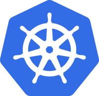

# K8s Training

## Environment configuration

#### Prerequisites:
* Docker installed
* Chocolatey
* Kubectl
* https://hub.docker.com/ account created
* ASP Net Core SDK 2.2 (https://dotnet.microsoft.com/download/dotnet-core/2.2) 
* Visual Studio 2019 with ASP .NET Core SDK (to build and publish your app)
* Azure CLI 

#### Chocolatey
Install chocolatey https://chocolatey.org/docs/installation
This package manager will be usefull to install other prerequisites.

#### Kubectl
```
choco install kubernetes-cli
```

#### Helm charts
```
choco install kubernetes-helm
```

#### Docker
Download and install docker https://www.docker.com/get-started

#### Minikube
1. Install minikube
``choco install minikube``
2. Run minikube 
``minikube start --vm-driver hyperv``

And 

Let's start :-)

---
## Setup azure access

[How setup azure access](./README_SETUPAZUREACCESS.md)

---
## "Hello World" deployment

[Deployment](./1_sample_application/README.md)

---
## Add storage

[Storage](./2_storage/README.md)

---

## Ingress

[Setup ingress](./4_ingress/README.md)

---

## Helm charts

[Helm charts](./5_helm/README.md)

---
## Materials:
   * https://medium.com/google-cloud/kubernetes-nodeport-vs-loadbalancer-vs-ingress-when-should-i-use-what-922f010849e0
   * **TBD** .......


---
## Usefull commands
* ``helm del $(helm ls --all --short) --purge``  remove all helm charts
* **TBD** .......
